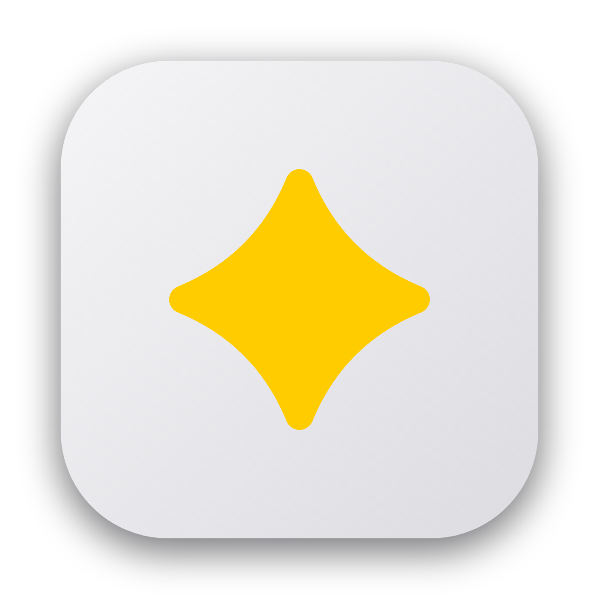
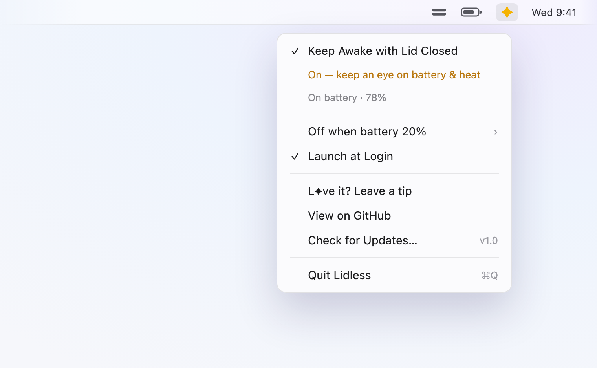

<div align="center">



# Lidless

**Close the lid. Keep working.**

A macOS menu-bar app that keeps your Mac awake with the lid shut — **no external monitor needed** — so the build, the agent, the render, the upload, *whatever you started* keeps going while you walk out the door.

[](LICENSE)


<sub>Notarized · Universal (Apple Silicon + Intel) · macOS 13+ · ~1–2 MB · No daemon, no telemetry</sub>

<br />



</div>

---

## The walk-across-town build

You kick off Claude — or whatever agent you've got driving — on a real task. Not a toy. A refactor across forty files, a test suite that takes twenty minutes, a migration that touches everything. It's *thinking*. It's *typing*. It's going to be a while.

So you close the lid, drop the MacBook in your backpack, and leave.

You're three blocks away when you pull out your phone, SSH back in, and check on it. The agent is still going. The lid is shut. The Mac is wide awake in the dark of your bag, churning through the work, and you're outside in the sun.

That's the whole idea. **Your Mac doesn't have to be open for your Mac to be working.** The desk was never the point — the desk was the leash. Lidless cuts it.

When you get where you're going, you flip the lid back up and there it is: the diff, the green checkmarks, the finished thing. It never stopped. Neither did you.

---

## Turn it on, walk away

The toggle is the easy part. The reason you'll actually *trust* it is the safety net watching your back the moment you're not looking:

- **🔋 Battery floor** — running on battery? Lidless flips back to normal sleep before the charge gets dangerous, so a forgotten laptop in a bag never drains to a hard zero.

You don't have to babysit it. That's the entire point.

---

## The menu-bar star

Lidless lives as a single star (`✦`) in your menu bar. No Dock icon, no window, no pop-over with sliders to fiddle — just a plain, native macOS menu you already know how to use.

- **✦ yellow** — awake. Lid-close sleep is off. Work continues.
- **✦ dimmed** — normal. Your Mac sleeps when you close it, like always.

Glance at the star and you know the state. It reads straight from the system, so it always reflects reality — not what it *hopes* is true.

---

## Who it's for

- **🚶 The AI-coding nomad.** You're running Claude Code, Codex, Cursor or another coding agent on your MacBook and remote-driving the work from your phone. You zip the laptop into your backpack, walk across the city, and the agent keeps building with the lid shut. The build finishes while you're crossing the street. *This is the one.*
- **🎬 The render-and-go crowd.** Long video exports, audio bounces, image batches — kick it off, close the lid, go get lunch.
- **⬆️ Anyone moving big bytes.** Multi-gigabyte uploads and downloads you don't want guillotined the moment the hinge clicks shut.
- **🛠️ Compile-and-test people.** Heavy builds and slow test suites that need the machine alive, not the human — running clamshell on your desk, no external display required.
- **🔌 SSH stay-reachable folks.** Keep the Mac on the network and reachable while it sits closed on a shelf — a little always-on box that doesn't nap when you fold it shut.
- **💾 The backup-and-bolt type.** Let Time Machine or a cloud sync finish before you unplug and pack up — no propped-open laptop required.

---

## A friendly word on heat *(read this once)*

Nothing scary — just physics worth knowing. A closed Mac that's staying awake has almost no airflow (the lid is the vent), so it runs warmer than usual, especially under a real workload and *especially* sealed inside a bag where the heat has nowhere to go.

Two easy habits and you're golden:

- **Give it a touch now and then.** If it's working hard in a backpack, check it isn't getting genuinely hot. Warm is fine; hot-and-trapped is worth opening the bag for.
- **Fanless MacBook Airs warm up faster.** No fan means heat has nowhere to shed, so don't seal one shut and forget about it for hours under load.

The **Battery floor** has your back on power — it cuts to normal sleep before your battery bottoms out. It doesn't manage *heat*, though. That part's on you, and it's an easy part. The menu even keeps you honest while it's on: *"On — keep an eye on battery & heat."*

---

## How it works *(no magic, no hand-waving)*

macOS has exactly one switch that overrides "lid closed → go to sleep": `pmset disablesleep`. Lidless flips that switch on when you want to stay awake, flips it off when you don't, and reads the current state back from `pmset -g` so the star always tells the truth.

That's the entire mechanism. No fake keystrokes, no background daemon pretending you moved the mouse. One real system setting, toggled honestly. It's essentially one Swift file driving a native `NSMenu` — you could read the whole thing over a coffee.

Changing that setting needs admin rights, so you get two honest paths:

1. **Zero setup.** The first time you toggle, macOS shows its standard admin-password dialog. Authenticate and you're done. Nothing is installed behind your back.
2. **One-time passwordless grant.** Prefer never to see the dialog again? Building with `install.sh` adds a narrow `sudoers` rule scoped to *exactly* `/usr/bin/pmset` and nothing else, so toggling is silent from then on.

No background helper hangs around. No invisible privileged daemon. What you see is what runs.

---

## Install

### Download (recommended — the no-grant path)

1. Grab the latest [**GitHub Release**](https://github.com/sshykvlv/lidless/releases/latest).
2. Unzip and drag **Lidless.app** into `/Applications`.
3. Double-click it.

It just *opens*. Lidless is **notarized by Apple** under a Developer ID, so there's no "unidentified developer" wall, no right-click-then-Open dance, no Gatekeeper detour. It ships as a **universal binary** — native on Apple Silicon and Intel — and needs **macOS 13 (Ventura) or newer**. The first time you toggle it on, macOS asks for your admin password once; approve it and you're set.

### Build from source *(adds the passwordless grant)*

```sh
git clone https://github.com/sshykvlv/lidless.git
cd lidless
./install.sh
```

`install.sh` builds the app, drops it in `/Applications`, **and** writes the one-line passwordless `pmset` grant — so toggling never prompts again. It asks for your admin password once (via the system dialog) to install that `sudoers` rule. Requires the Xcode command-line tools. When it's done, look for the star in your menu bar. *(Want no grant at all? Use the Release download above instead.)*

---

## Why so small, why so quiet

Because a thing that keeps your Mac awake shouldn't need a Dock icon, a settings window with twelve tabs, a phone-home analytics pipeline, or a launch daemon you'll find two years from now and not remember installing.

No daemon. No kext. No telemetry — it doesn't phone home because there's nothing to phone home about. It does one job, makes its one privileged action explicit, weighs almost nothing, and ships every line of its source under MIT. That's the whole design philosophy, and it fits in a sentence.

---

## L✦ve it? Fuel it

If Lidless has bought you a few walks across town — saved a build, a render, or your sanity — a tip buys the next coffee.

> ☕ [**Leave a tip**](https://buy.stripe.com/5kQ14ogr4dq9fky4Mm0Jq02) — pay what you want, entirely optional.

---

## License

[MIT](LICENSE) — use it, fork it, read every line of it. Built by **Sasha Yakovlev** · [app@ykv.lv](mailto:app@ykv.lv).

[github.com/sshykvlv/lidless](https://github.com/sshykvlv/lidless)

<div align="center">
<sub>Made for people who'd rather close the lid and keep moving.</sub>
</div>